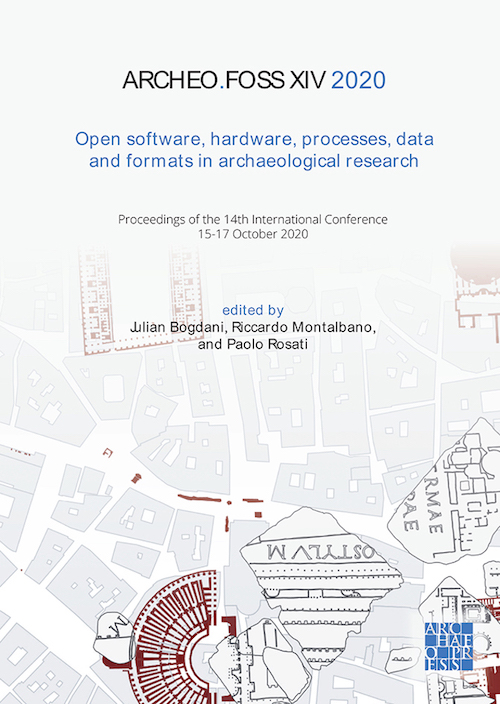

## Conference proceedings

Bogdani, Julian, Riccardo Mantalbano, and Paolo Rosati. eds. 2021. _ArcheoFOSS XIV 2020: Open Software, Hardware, Processes, Data and Formats in Archaeological Research_. Oxford: Archaeopress.

Availabe for free download at [Archaeopress.com](https://www.archaeopress.com/ArchaeopressShop/Public/displayProductDetail.asp?id={31193B62-F0B1-4C51-BA08-3D85FCA58990}).  
Paperback; 174x245mm; 204pp; Illustrated in colour throughout. Papers in Italian and English. Print RRP: £38.00. 796 2021. Available both in print and Open Access. Printed ISBN 9781803271248. Epublication ISBN 9781803271255

During the 2021 edition works it will be possible to order a copy of the printed version and benefit of the special offer of **£28.50** instead of the full price of £38.00. Please use [this offer-leaflet](images/AA Bogdani pre-order offer.pdf) to order your volume now!

## Book of abstracts

The **Book of Abstracts** is freely available (golden open access, CC BY-SA 4.0) since 26/08/2020 in Zenodo .

### License

All the contents will be published under a [Creative Commons Attribution International (CC BY International)](https://creativecommons.org/licenses/by/4.0/) license.
